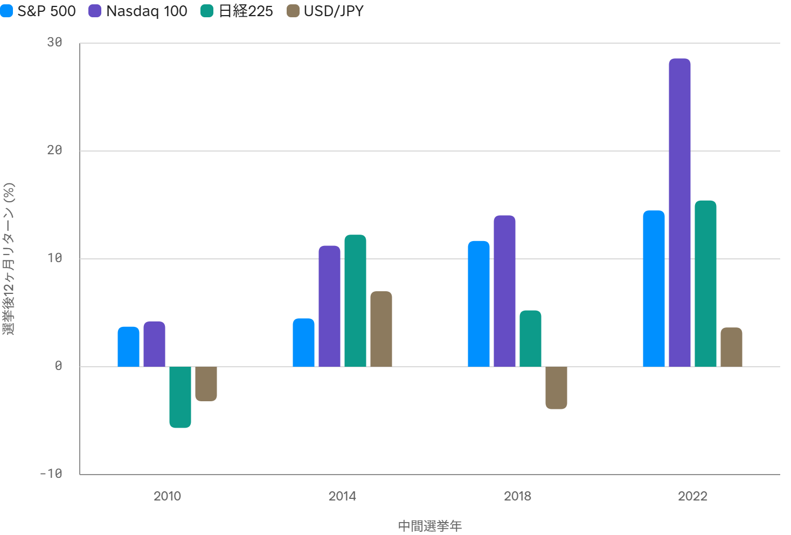
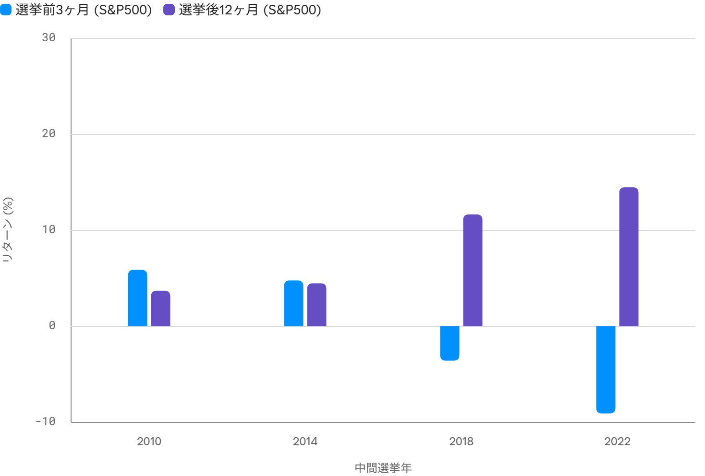

<!--
id: RX-USECASE-0074
type: use-case
language: en
locale: en
provider: QUICK Inc.
source_created: 2026-10-05
provided: 2026-10-05
status: published
translation_status: canonical
original_language: ja
source_text_status: translated_from_partner_source_reconciled_with_original
editorial_reviewed: 2026-10-05
source_type: partner-provided-use-case
source_manifest: RX-USECASE-0074
asset_class: Multi-Asset, Equities, FX, Macro
insight_type: Scenario Insight
publication_mode: faithful-source-preserving
prompt_status: present
-->

# Compare U.S. Midterm Elections With Current Cross-Market Conditions

<!-- locale-switcher:start -->
**Languages:** **English** · [日本語](../../../../ja/05-ユースケース/03-運用資産別/05-マルチアセット/米中間選挙後の米国株・ドル円・日本株を過去事例と比較する.md) · [한국어](../../../../ko/05-유스케이스/03-운용자산별/05-멀티에셋/미국-중간선거-이후-미국주식-달러엔-일본주식을-과거사례와-비교하기.md) · [简体中文](../../../../zh-cn/05-使用案例/03-按资产类别/05-多资产/比较美国中期选举后的美股-美元日元与日股表现.md) · [繁體中文（台灣）](../../../../zh-tw/05-使用案例/03-依資產類別/05-多資產/比較美國期中選舉後的美股-美元日圓與日股表現.md) · [繁體中文（香港）](../../../../zh-hk/05-使用案例/03-按資產類別/05-多資產/比較美國中期選舉後的美股-美元日圓及日股表現.md)
<!-- locale-switcher:end -->

[← Multi-Asset use cases](README.md) · [Browse by asset class](../README.md) · [All use cases](../../README.md)

**Provided:** 2026-10-05  
**Primary assets:** U.S. equities, FX, Japanese equities, Macro

> Figures, election-probability inputs, and market conditions are snapshots from the supplied 2026-10-05 analysis, not current forecasts.

> The provided material did not include a direct Reflexivity link for this example.

## Prompt used

> [!IMPORTANT]
> What will happen to the U.S. stock market in the November U.S. midterm elections? Analyze the market impact on U.S. equities, FX, Japanese equities, and other markets by comparing past cases with current conditions.

## What the prior four midterms showed

The supplied analysis compares the **2010, 2014, 2018, and 2022** U.S. midterm elections. In all four observations, the S&P 500 was positive over the 12 months after the election, averaging about **+8.6%**. The Nasdaq 100 averaged about **+14.5%** over the same horizon.

> The chart labels below remain in Japanese because the analysis was created in a Japanese-language environment.

*Original chart: 12-month returns after the 2010, 2014, 2018, and 2022 U.S. midterm elections.*

In **2018**, the S&P 500 moved **-3.6%** over the three months before the election and **+11.7%** over the following 12 months. In **2022**, the corresponding figures were **-9.1%** and **+14.5%**. The source treats this as a historical anomaly rather than a causal rule.

*Original chart: S&P 500 pre-election and post-election returns for the four prior midterms.*

## Why the 2026 setup is different

The supplied snapshot places the S&P 500 at **7,666.45** and the Nasdaq 100 at **26,871.60**, both near recent highs. It also shows the federal funds rate at about **3.75%**, CPI at about **3.35%**, and USD/JPY at about **158.07**.

Several prior cases began after deeper pre-election weakness. Starting near highs leaves less room for the same “selloff then rebound” pattern, so the source cautions against applying the historical pattern mechanically.

## Cross-market scenario reading

### U.S. equities

The historical examples favor post-election strength, but the 2026 starting point is different. The source also notes that a divided-government outcome could be received positively if it increases policy predictability. That outcome was not final when the analysis was provided.

### USD/JPY

The four historical cases showed no consistent post-midterm direction in USD/JPY, with outcomes roughly from **-3.9% to +7.0%**. The analysis therefore treats U.S.-Japan rate differentials and Bank of Japan policy as more important drivers than the election alone.

### Japanese equities

The Nikkei 225 rose in three of the four historical comparisons: **+12.2% in 2014**, **+5.2% in 2018**, and **+15.4% in 2022**, while **2010 was -5.7%**. In the supplied 2026 snapshot, the Nikkei 225 was **68,309.46** and about **+52.01% over one year**, also a very different starting point.

## Limitations

- The comparison contains only four midterm-election observations.
- The pattern is an anomaly, not evidence that the election caused subsequent returns.
- The 2010 and 2022 cases included unusual macro and policy conditions.
- The 2026 setup begins with major equity indexes near record highs.
- Election results, prediction-market probabilities, and model outputs were not final and can change.
- Returns are price returns and exclude dividends and reinvestment.

## Source note

This page is based on a QUICK-provided Reflexivity usage example dated 2026-10-05.

This content was provided by QUICK.

Depending on country or region, language environment, product used, entitlements, and data coverage, the example may not be directly reproducible as written.

[← Multi-Asset use cases](README.md) · [All use cases](../../README.md)
