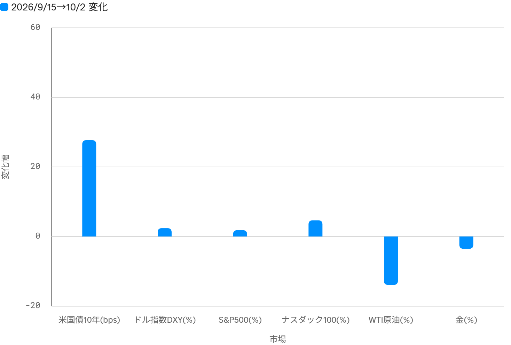
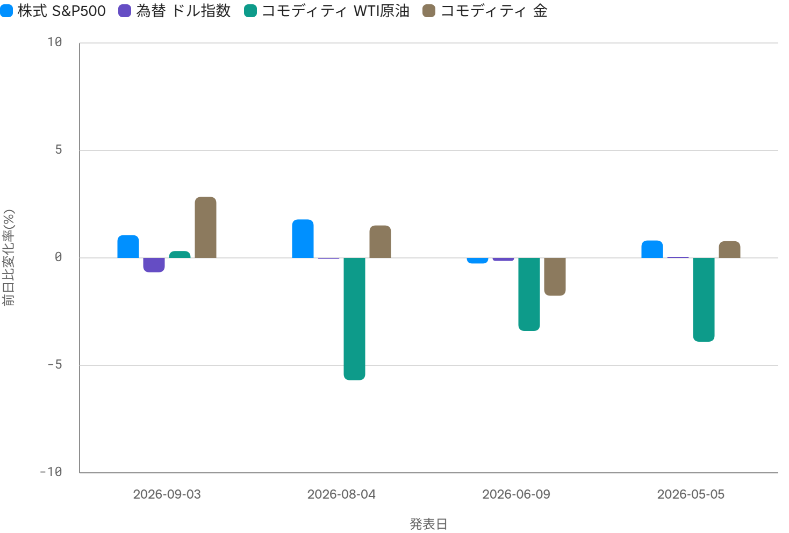

<!--
id: RX-USECASE-0075
type: use-case
language: en
locale: en
provider: QUICK
source_created: 2026-10-06
provided: 2026-10-06
status: published
translation_status: canonical
original_language: ja
source_text_status: original_partner_source_reconciled
editorial_reviewed: 2026-10-06
source_type: partner-provided-use-case
source_manifest: RX-USECASE-0075
asset_class: Multi-Asset, Fixed Income, FX, Equities, Commodities, Macro
insight_type: Market Catalyst
publication_mode: faithful-source-preserving
prompt_status: present
-->

# Compare the U.S. trade-balance outlook with past cross-market reactions

<!-- locale-switcher:start -->
**Languages:** **English** · [日本語](../../../../ja/05-ユースケース/03-運用資産別/05-マルチアセット/米国貿易収支の見通しと発表日の市場反応を比較する.md) · [한국어](../../../../ko/05-유스케이스/03-운용자산별/05-멀티에셋/미국-무역수지-전망과-발표일-시장반응을-비교하기.md) · [简体中文](../../../../zh-cn/05-使用案例/03-按资产类别/05-多资产/比较美国贸易收支展望与发布日市场反应.md) · [繁體中文（台灣）](../../../../zh-tw/05-使用案例/03-依資產類別/05-多資產/比較美國貿易收支展望與公布日市場反應.md) · [繁體中文（香港）](../../../../zh-hk/05-使用案例/03-按資產類別/05-多資產/比較美國貿易收支展望與公布日市場反應.md)
<!-- locale-switcher:end -->

[← Multi-Asset Use Cases](README.md) · [Browse by asset class](../README.md) · [All Use Cases](../../README.md)

**Provided:** 2026-10-06  
**Primary assets / areas:** U.S. Treasuries, U.S. equities, FX, commodities, macro

> This is a pre-release snapshot from the morning of 2026-10-06 in Japan. At that point, the August U.S. total trade balance had not yet been released. It should not be read as a current forecast.

> This use case does not include a direct Reflexivity link.

## Prompt used

> [!IMPORTANT]
> **First question:** What is the outlook for the U.S. trade balance being released today? Also, among equities, bonds, foreign exchange, and commodities, which market is likely to be most affected by this release?
>
> **Follow-up question:** Looking back at prior releases, analyze how each market moved on the day of the announcement.

## Why the follow-up matters

The first pass combined the trade-balance outlook with the broader market backdrop, making the rise in U.S. Treasury yields look especially prominent. The follow-up narrows the question to an event study: **what actually happened on prior trade-balance release days, and how large was the data surprise?**

That second step changes the interpretation. The prior four releases were close to consensus, and the evidence does not show that the trade-balance release itself was the main driver of the largest same-day market moves.

## Pre-release outlook for the August trade balance

The release was scheduled for 8:30 a.m. U.S. Eastern Time on 2026-10-06.

| Item | Reference month | Market expectation | Actual |
| --- | --- | ---: | ---: |
| Total trade balance, goods and services | August 2026 | -$89.8bn | Not yet released |
| Advance goods trade balance | August 2026 | -$115.0bn | -$132.64bn |
| Total trade balance, goods and services | July 2026 | -$90.0bn | -$88.6bn |

The advance goods figure was materially weaker than expected. Imports were reported up **5.5%**, so the analysis treated a wider August total trade deficit as a meaningful risk.

## Market backdrop before the release

From **2026-09-15 to 2026-10-02**, the analysis recorded:

- U.S. 10-year Treasury yield: about **+28bp**, reaching roughly **5.28%**.
- DXY: about **+2.4%**.
- S&P 500: about **+1.8%**.
- Nasdaq 100: about **+4.65%**.
- WTI crude: about **-13.9%**.
- Gold: about **-3.5%**.

These moves are context, not a clean estimate of the trade-balance effect. Employment data, interest rates, Middle East developments, commodity supply-demand conditions, and other headlines were also being priced.

> The chart labels below remain in Japanese because the source analysis was created in a Japanese-language environment. U.S. 10-year yields are shown in basis points while the other markets are shown in percent, so bar heights are not directly comparable.

## What the prior four release days show

The follow-up compared the prior close with the close on each release day for the four most recent total trade-balance releases available in the analysis.

| Release date | Reference month | Surprise ($bn) | U.S. 10Y | S&P 500 | DXY | WTI | Gold |
| --- | --- | ---: | ---: | ---: | ---: | ---: | ---: |
| 2026-09-03 | July | +1.4 | -1.2bp | +1.06% | -0.67% | +0.32% | +2.84% |
| 2026-08-04 | June | -0.3 | -6.3bp | +1.79% | -0.04% | -5.69% | +1.51% |
| 2026-06-09 | April | +0.5 | -3.8bp | -0.26% | -0.14% | -3.40% | -1.76% |
| 2026-05-05 | March | +0.2 | +5.6bp | +0.81% | +0.05% | -3.90% | +0.78% |

> The chart labels below remain in Japanese because the source analysis was created in a Japanese-language environment. The U.S. 10-year yield is shown separately in the table because the source expresses it in basis points.

## How to interpret the result

Across the prior four releases, the reported surprise was within **±$1.4bn** of consensus. DXY stayed within about **±0.7%**, and the U.S. 10-year yield moved by an average of roughly **4.2bp** in absolute terms, with no consistent direction.

WTI and gold showed larger moves on some of those days, but the analysis does **not** attribute those moves directly to the trade-balance release. Commodity supply-demand, geopolitical developments, safe-haven demand, employment data, rates, and other same-day factors were also active.

The more useful research question is therefore not simply “which asset moves the most?” It is **how large the trade-balance surprise is relative to expectations, and whether rates and FX respond in a way consistent with that surprise after accounting for the rest of the day's news flow.**

## Caveats

- The event study uses daily closes. The 8:30 a.m. release is therefore mixed with every other market-moving event that occurred before the same-day close; it is not a pure immediate-reaction study.
- U.S. Treasury moves are measured in **basis points** while the other markets are measured in **percent**. Their absolute magnitudes should not be compared mechanically.
- At the source snapshot, the 2026-10-06 August total trade-balance actual had not yet been released.
- The source contains an internal arithmetic inconsistency. It lists the August advance-goods balance at **-$132.64bn versus -$115.0bn expected**, while a later sentence describes the miss with a different derived amount. This page preserves the stated expectation and actual levels and does not treat that later derived amount as verified.

## Data used in the analysis

**Entities:** US_G10Y, SPX, DX:ICE, CL:NYMEX, GC:COMEX, NDX

**Time series:** US_G10Y.yield, SPX.price, DX:ICE.price, CL:NYMEX.price, GC:COMEX.price, NDX.price

## Source note

This page is based on a QUICK-provided Reflexivity usage example dated 2026-10-06.

This content was provided by QUICK.

Depending on country or region, language environment, product used, entitlements, and data coverage, the example may not be directly reproducible as written.

[← Multi-Asset Use Cases](README.md) · [All Use Cases](../../README.md)
