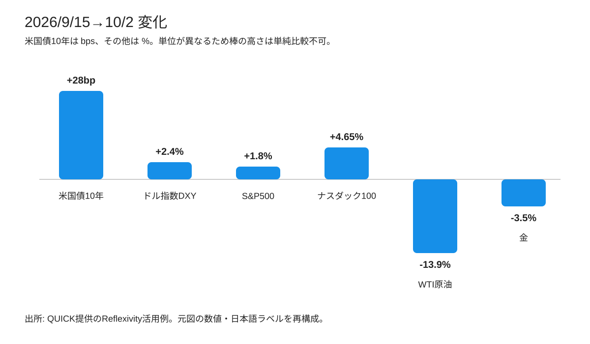
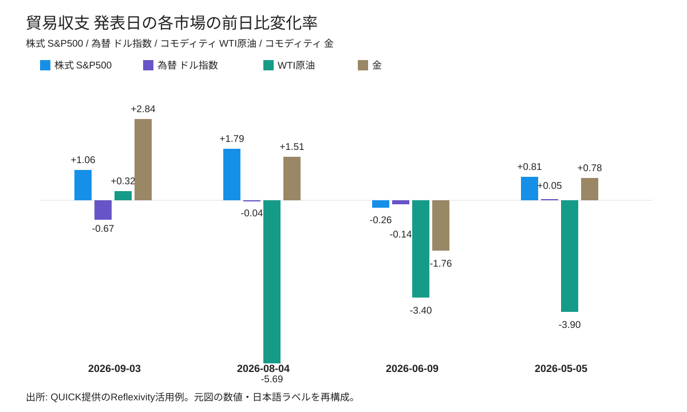

<!--
id: RX-USECASE-0075
type: use-case
language: zh-cn
locale: zh-CN
provider: QUICK
source_created: 2026-10-06
provided: 2026-10-06
status: published
translation_status: current
original_language: ja
source_text_status: translated_from_canonical_en
editorial_reviewed: 2026-10-06
source_type: partner-provided-use-case
source_manifest: RX-USECASE-0075
asset_class: 多资产, 固定收益, FX, 股票, 大宗商品, 宏观
insight_type: Market Catalyst
publication_mode: faithful-source-preserving
prompt_status: present
-->

# 比较美国贸易收支展望与发布日市场反应

<!-- locale-switcher:start -->
**Languages:** [English](../../../../en/05-use-cases/03-asset-class/05-multi-asset/us-trade-balance-outlook-and-cross-market-reactions.md) · [日本語](../../../../ja/05-ユースケース/03-運用資産別/05-マルチアセット/米国貿易収支の見通しと発表日の市場反応を比較する.md) · [한국어](../../../../ko/05-유스케이스/03-운용자산별/05-멀티에셋/미국-무역수지-전망과-발표일-시장반응을-비교하기.md) · **简体中文** · [繁體中文（台灣）](../../../../zh-tw/05-使用案例/03-依資產類別/05-多資產/比較美國貿易收支展望與公布日市場反應.md) · [繁體中文（香港）](../../../../zh-hk/05-使用案例/03-按資產類別/05-多資產/比較美國貿易收支展望與公布日市場反應.md)
<!-- locale-switcher:end -->

[← 多资产使用案例](README.md) · [按资产类别浏览](../README.md) · [全部使用案例](../../README.md)

**提供日期:** 2026-10-06  
**主要资产 / 领域:** 美国国债、美国股票、FX、大宗商品、宏观

> 本页是2026-10-06日本时间上午的发布前快照。当时8月美国综合贸易收支尚未公布，不应将其视为当前预测。

> 本使用案例未提供可直接打开的Reflexivity链接。

## 使用的提示词

> [!IMPORTANT]
> **第一次提问:** 请说明今天公布的美国贸易收支展望，并分析此次发布对股票、债券、外汇和大宗商品中哪个市场可能影响最大。
>
> **追加提问:** 请回顾过去的发布，并分析发布当天各市场如何变化。

## 为什么追加提问很重要

第一次回答把贸易收支展望与近期市场背景放在一起，因此美国国债收益率的上升显得较为突出。追加提问把问题收窄到**过去贸易收支发布日各市场实际波动了多少，以及实际值与预期相差多少**。

这一比较显示，过去四次实际值都接近市场预期，没有充分证据表明贸易收支发布本身是当天最大市场波动的主要原因。

## 8月贸易收支发布前展望

发布计划时间为2026-10-06美国东部时间上午8:30。

| 项目 | 对应月份 | 市场预期 | 实际值 |
| --- | --- | ---: | ---: |
| 综合贸易收支（商品和服务） | 2026年8月 | -898亿美元 | 尚未公布 |
| 预估商品贸易收支 | 2026年8月 | -1,150亿美元 | -1,326.4亿美元 |
| 综合贸易收支（商品和服务） | 2026年7月 | -900亿美元 | -886亿美元 |

8月预估商品贸易收支明显弱于预期，进口增长**5.5%**。因此，分析认为8月综合贸易逆差进一步扩大的风险值得关注。

## 发布前的市场背景

**2026-09-15至2026-10-02**期间：

- 美国10年期国债收益率约**+28bp**，至约**5.28%**。
- 美元指数DXY约**+2.4%**。
- S&P 500约**+1.8%**。
- Nasdaq 100约**+4.65%**。
- WTI原油约**-13.9%**。
- 黄金约**-3.5%**。

这些变化是市场背景，并不能单独归因于贸易收支。就业数据、利率、中东局势以及大宗商品供需等因素也同时影响市场。

> 下图根据原图的数值和日文标签重新绘制。美国10年期国债以bps表示，其他市场以%表示，因此不能直接比较柱形高度。

## 过去四次发布日的市场反应

追加分析比较了最近四次综合贸易收支发布日前一日收盘与发布日收盘的变化。

| 发布日 | 对应月份 | 意外幅度（十亿美元） | 美国10年期 | S&P 500 | DXY | WTI | 黄金 |
| --- | --- | ---: | ---: | ---: | ---: | ---: | ---: |
| 2026-09-03 | 7月 | +1.4 | -1.2bp | +1.06% | -0.67% | +0.32% | +2.84% |
| 2026-08-04 | 6月 | -0.3 | -6.3bp | +1.79% | -0.04% | -5.69% | +1.51% |
| 2026-06-09 | 4月 | +0.5 | -3.8bp | -0.26% | -0.14% | -3.40% | -1.76% |
| 2026-05-05 | 3月 | +0.2 | +5.6bp | +0.81% | +0.05% | -3.90% | +0.78% |

> 下图根据原图的股票、外汇和大宗商品前日比数值及日文标签重新绘制。美国10年期国债因单位为bp，在表格中单独列示。

## 如何解读结果

过去四次发布中，实际值与市场预期的差距均在**±14亿美元以内**。DXY在各发布日大致都在**±0.7%以内**，美国10年期国债收益率的绝对变动平均约**4.2bp**，方向也不一致。

WTI和黄金在部分发布日波动更大，但分析并未将这些变化直接归因于贸易收支。原油供需、地缘政治、避险需求、就业和利率等其他当日因素也在发挥作用。

因此，更有用的问题不是简单判断“哪个资产波动最大”，而是**贸易收支实际值偏离预期多少，以及在考虑同日其他新闻因素后，利率和外汇是否对这一意外幅度作出一致反应。**

## 注意事项

- 日频数据比较的是前一日收盘到发布日收盘，并不是发布后几分钟或一小时的纯粹即时反应。
- 债券以**bp**表示，其他市场以**%**表示，不能机械比较绝对幅度。
- 原分析时点，2026-10-06发布的8月综合贸易收支实际值尚未公布，因此未纳入比较。
- 原分析内部存在一个数值不一致。其列出8月预估商品贸易收支为**预期-1,150亿美元、实际-1,326.4亿美元**，但后文对预期差额使用了另一数值。本页保留预期值和实际值本身，不把后文差额作为已验证数据。

## 分析使用的数据

**实体:** US_G10Y、SPX、DX:ICE、CL:NYMEX、GC:COMEX、NDX

**时间序列:** US_G10Y.yield、SPX.price、DX:ICE.price、CL:NYMEX.price、GC:COMEX.price、NDX.price

## 提供方

本页根据QUICK于2026-10-06提供的Reflexivity使用案例整理。

受国家或地区、语言环境、使用产品、权限及数据覆盖范围影响，本案例未必能完全按本文方式复现。

[← 多资产使用案例](README.md) · [全部使用案例](../../README.md)
